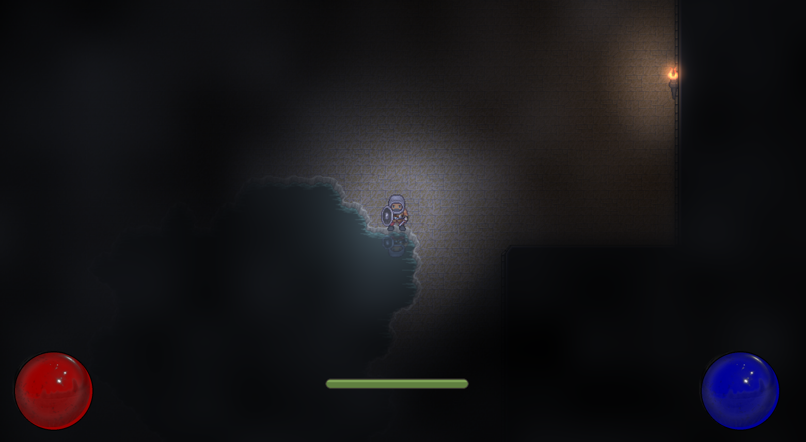

## Nikolaj Jenning Hansen

Robotics and software developer at Uniwelco — robotic welding systems, where
software meets production equipment. These are the projects I build outside work.

---

### The Beckoning — action RPG &nbsp;·&nbsp; private

A top-down action RPG in the vein of Diablo 1, built solo in Python with pygame
and in continuous development since January 2021. Procedurally generated
dungeons with guaranteed connectivity, dynamic lighting and fog of war with an
OpenGL path and a CPU fallback, and enemy AI on A* pathfinding.

**1,239 commits &nbsp;·&nbsp; ~50,000 lines &nbsp;·&nbsp; 137 modules**
 Python · pygame-ce · moderngl · numpy · pytmx · Tiled

The repository is private: development is active, and the game ships several
hundred third-party art and audio assets under CC-BY-SA, CC-BY, OGA-BY and GPL
licences, which makes any public release its own piece of work.

### Data automation &nbsp;·&nbsp; private

Python tooling that pulls data from Google Drive and Google Sheets and sends
mail over SMTP, authenticating with OAuth 2.0.
